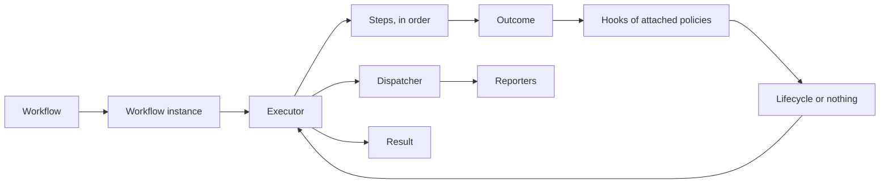

# 1. Concepts

Specification 0.1. Written from proposals [0002](../proposals/0002-foundations.md), [0008](../proposals/0008-steps.md), [0009](../proposals/0009-running-a-workflow.md), [0010](../proposals/0010-hooks-lifecycles-and-roles.md), [0011](../proposals/0011-events.md), [0012](../proposals/0012-local-executor.md), [0024](../proposals/0024-abnormal-termination-retriable.md), [0027](../proposals/0027-received-data-read-only.md) and [0032](../proposals/0032-configuration-errors.md).

This chapter is the single source of Itinera's vocabulary. Every other chapter, every proposal and every implementation uses these words with these meanings; they are not synonyms of each other. This chapter defines what each thing is and how the things relate. What each one does, exactly, is defined by the chapters that follow.

## 1.1 The idea

Itinera separates two kinds of decision. **Business rules** decide what the business does, and live in steps. **Flow control** decides what happens around that work (try again, give up, finish early), and lives in policies, whose hooks the executor calls after each outcome. A step cannot reach the workflow that runs it, so the separation is structural rather than a matter of discipline.

## 1.2 Workflows and steps

- **Workflow:** the plan. An ordered list of steps, plus the policies, input adapters, roles and reporters attached to it. A workflow is declarative: everything in it is fixed before anything runs, and it can be listed without running it.
- **Step:** a business unit, identified by a name unique within its workflow. A step declares the data it needs, does its work, contributes data back, and reports an **outcome**. It knows nothing of the workflow, the executor or other steps, and it does not know its own name.
- **Step descriptor:** what the workflow holds for each step: its name, how to build it, its retry budget, whether an abnormal termination may be retried, and the step policies and input adapters attached to it.
- **Outcome:** what a step reports when it runs to the end: **Success**, **Failure** or **Skipped**. An outcome says what happened, never what to do next.
  - **Failure** carries a **reason** (a code, an optional message and optional details) and a **retriable** flag: whether the step believes trying again might help.
  - **Skipped** means the step decided, from what it knows of its domain, not to do its work. A skipped step leaves the flow.
- **Abnormal termination:** an error, exception or panic that escapes a running step. It is not an outcome the step chose; it ends the attempt as a failure.
- **Attempt:** one execution of a step. The first is attempt 1. A **retry** is any attempt after the first; a step's **retry budget** is how many retries it allows.
- **Step status:** where a step stands in a journey: `NotExecuted`, `Executing`, `MustRetry`, `Succeeded`, `Failed`, `Skipped` or `Aborted`.

## 1.3 Data

- **Data bag:** the untyped store of a journey's data, a map from string keys to values. It starts with the workflow instance's initial data and changes only through committed contributions. At the end of a journey it is the journey's output.
- **Data from the workflow:** a value a step or hook requests by a key and a type, as **required** or **optional**. Where it comes from is decided by the workflow, never by the requester.
- **Input adapter:** an object declared on the workflow and associated with pairs of step and key. It supplies data from the workflow for those pairs from anywhere it likes. Without one, the value is read from the data bag under the key.
- **Adapter:** in tier 1, an input adapter. There are no adapters for data from a step.
- **Data from the step:** a value a step hook requests from the step it acts on, by key and type, as required or optional. It is exactly what that step contributed.
- **Contributor:** the object through which a step or a hook contributes data, as key and value pairs. It is the only way to change the data bag.
- **Contribution:** a key and value given to a contributor. A step's contributions are **committed** to the data bag only when its attempt succeeds; a hook's are committed when the hook returns.

## 1.4 Policies, hooks and lifecycles

- **Policy:** a reusable object that defines one or more hooks. A **step policy** defines only step hooks and is attached to steps. A **workflow policy** defines only workflow hooks and is attached to workflows.
- **Hook:** a function of a policy that the executor calls. **Step hooks** (`on step success`, `on step failure`, `on step retry`, `on step abnormal termination`) are called in response to a step's outcome. **Workflow hooks** (`on workflow success`, `on workflow failure`) are called when the journey ends. A hook that no attached policy defines takes its default behaviour.
- **Lifecycle:** what a hook may return to tell the executor what to do next, instead of the default. Tier 1 has two: `FailWorkflow` and `FinishWorkflow`.
- **Cause:** why the failure hook or the retry hook was called: `failure`, `retriable failure`, `abnormal termination` or `retries exhausted`.
- **Workflow role:** an interface of operations that a workflow implements and provides to policies, for example "send a notification". A hook requests the roles it needs; roles carry operations, never data.

## 1.5 Running

- **Workflow instance:** created by the developer's own code for each journey, from a workflow, with the journey's initial data. It holds the data bag and all other journey state.
- **Executor:** runs a workflow instance and carries out what hooks decide. The **local executor** runs a journey in process, with no persistence.
- **Journey:** one end-to-end execution of a workflow instance, from the first step to its result. In later tiers a journey may move between workflows through switches and transfers.
- **Run:** one workflow executed within a journey. In tier 1 a journey has exactly one run, so the two coincide.
- **Journey ID:** the identifier of a journey, produced by the workflow's ID generator.
- **The scan:** how the executor chooses what to do next: it repeatedly considers the first step that is not finished.
- **Result:** what running a journey returns: its final status (succeeded, failed or aborted), every step's status and attempt count, the data bag, and, for a journey that did not succeed, where and why.
- **Failed journey:** a journey that ended because a step failed or a hook returned `FailWorkflow`. A failure is a legitimate end, decided by the outcomes and the policies.
- **Aborted journey:** a journey stopped because something illegal happened: a configuration error found while running, a hook that threw, or a reporter that threw. No hook runs after an abort. Each abort has an **abort reason**.

## 1.6 Events

- **Event:** a record of something that happened in a journey, with fixed fields. **Engine events** are emitted by the executor; steps emit `step_*` events and hooks emit `journey_*` events.
- **Event stream:** every event of one journey, in order. It is never rolled back or rewritten. It is how a journey is observed, and how conformance judges implementations.
- **Reporter:** receives events, one at a time, and decides on its own what to do with them. The workflow lists its reporters; a step receives a **step reporter** to emit its own events.
- **Dispatcher:** owned by the executor; holds reporters and delivers each event to them.

## 1.7 Configuration and admission

- **Configuration error:** anything wrong with how a workflow is put together or supplied, which its author is responsible for.
- **Violation:** one configuration error, by name, such as `duplicate step name`.
- **Admission:** checking a workflow's configuration before anything runs. It happens when the workflow is built where the language can do it, and otherwise when the journey runs.

## 1.8 Tiers and capabilities

- **Tier:** a cumulative level of meaning. Tier 1 is a single workflow; each later tier includes everything before it. The contents of a tier are fixed for a given version of this specification.
- **Capability:** an independent property of an executor or a language: in tier 1, the execution modes `sync` and `async`, and exactly one of `build-time-configuration-check` or `run-time-configuration-check`.
- **Execution mode:** whether a step, hook or reporter is synchronous or asynchronous.

## 1.9 How the concepts fit together

The diagram shows:

1. A developer creates a **workflow instance** from a **workflow**, with its initial data, and hands it to an **executor**.
2. The executor runs the **steps** in order. Each step requests data from the workflow and contributes data through its contributor.
3. Each step reports an **outcome**. The executor calls the **hooks** of the policies attached to that step.
4. Each hook returns a **lifecycle** or nothing, and the executor carries it out: the next step, a retry, a failed journey or a finished one.
5. Throughout, the executor emits **events** through its **dispatcher** to the workflow's **reporters**.
6. The journey ends with a **result**, which carries the data bag as its output.
