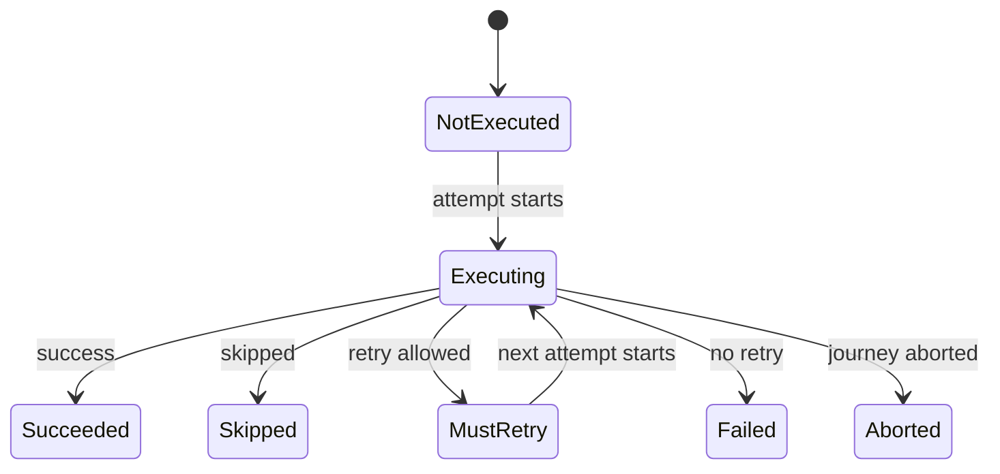

# 5. Running a journey

Specification 0.1. Written from proposals [0009](../proposals/0009-running-a-workflow.md) as amended by [0032](../proposals/0032-configuration-errors.md), [0012](../proposals/0012-local-executor.md) and [0024](../proposals/0024-abnormal-termination-retriable.md).

How an executor runs a workflow instance: the instance and its data, journey IDs, the scan, step statuses, retries, the result, and the executor itself. What the hooks called along the way may decide is defined in chapter 6; where this chapter says "by default", a hook may change it there.

## 5.1 The workflow instance

1. **One workflow instance per journey.** The developer's own code creates a workflow instance from a workflow for each journey and hands it to an executor. A failure while creating the instance happens before the executor is involved.
2. **Initial data.** The instance MAY be created with initial data, and MAY obtain more while it is created. Whatever it holds when handed to the executor MUST be the initial content of the data bag. Keys are strings; values MAY be any value the language can hold.
3. **The instance holds the journey's state.** The executor asks the instance for its step descriptors, its data bag, its reporters and everything else it needs. The data bag and all other journey state belong to the instance.
4. **An instance runs at most one journey.** Handing an executor an instance that has already run, or is running, MUST be refused as a configuration error.

## 5.2 Journey IDs

1. In tier 1 a journey has exactly one run, so it has one ID, the **journey ID**.
2. If the workflow defines a custom ID generator, the executor MUST call it; otherwise the workflow's default generator MUST produce a UUID v4. A custom generator belongs to the instance, so it MAY derive the ID from the instance's own data.
3. The caller does not pass an ID to the executor.

## 5.3 The data bag

1. Each journey has one data bag, held by the workflow instance.
2. It starts with the initial data. `journey_started` MUST list the initial keys and MUST NOT carry their values.
3. It receives committed contributions, from steps (chapter 4) and hooks (chapter 6), and is read by input resolution (chapter 4) and by hooks' requests (chapter 6). Nothing else changes it.

## 5.4 Step statuses

1. Every step has a status in the journey:

   | Status | Meaning |
   |---|---|
   | `NotExecuted` | the step has not run yet, or never ran |
   | `Executing` | an attempt of the step is running |
   | `MustRetry` | the last attempt failed and another will be made |
   | `Succeeded` | the step succeeded |
   | `Failed` | the step failed and will not be tried again |
   | `Skipped` | the step skipped itself |
   | `Aborted` | the journey was aborted during this step |

2. Every step starts as `NotExecuted`. After an abort, the steps after the aborted one remain `NotExecuted`.
3. **Run-once.** A step that ended as `Succeeded`, `Failed` or `Skipped` MUST NOT run again in the journey.

## 5.5 Order and the scan

1. **Strict order.** Steps MUST run in the order of their step descriptors. Nothing can reorder steps, skip a step other than the step itself, or jump between steps.
2. **The scan.** The executor repeatedly considers the first step that is not finished:
   - a `Succeeded` or `Skipped` step is passed over;
   - a `NotExecuted` or `MustRetry` step is built and run (chapter 4), as its next attempt;
   - a `Failed` step ends the journey as failed;
   - when no step is left, the journey succeeds.

The diagram shows these transitions:

1. A step starts as `NotExecuted`, and becomes `Executing` when its first attempt starts.
2. From `Executing`, it becomes `Succeeded` on success, `Skipped` on a skip, `MustRetry` when a retry is allowed (5.6), `Failed` when no retry is allowed, and `Aborted` when the journey is aborted during it.
3. From `MustRetry`, it becomes `Executing` again when the next attempt starts.
4. `Succeeded`, `Skipped`, `Failed` and `Aborted` are final.

## 5.6 Attempts and retries

1. **Attempts are counted from 1.** The first execution of a step is attempt 1. A step with a retry budget of N MUST be attempted at most N + 1 times.
2. **What is retried.** A retriable failure, or an abnormal termination when the step descriptor sets `abnormal termination retriable`, MUST put the step in `MustRetry` while its retry budget allows another attempt. Both use the same budget.
3. **When the budget is exhausted**, the step becomes `Failed`, and its failure hook is called with the cause `retries exhausted`.
4. **What is not retried.** A failure that is not retriable makes the step `Failed` at once, with the cause `failure`. An abnormal termination that is not retriable makes the step `Failed` at once, with the cause `abnormal termination`.
5. **A retry happens immediately.** The executor MUST NOT wait between attempts. A step that needs to wait before reporting a failure does so itself.

## 5.7 How a journey ends

1. **Succeeded:** every step ended as `Succeeded` or `Skipped`, or a hook returned `FinishWorkflow` (chapter 6). Steps that did not run remain `NotExecuted`.
2. **Failed:** a step ended as `Failed`, or a hook returned `FailWorkflow` (chapter 6). Later steps do not run, and remain `NotExecuted`.
3. **Aborted:** something illegal happened. The step during which it happened, if any, becomes `Aborted`; later steps remain `NotExecuted`, and no hook runs afterwards. The abort reasons are:

   | Abort reason | When | Defined in |
   |---|---|---|
   | `step could not be built` | a step's constructor or an input adapter failed | chapter 4 |
   | `required data missing` | a required request has no value | chapters 4 and 6 |
   | `wrong type` | a requested value has the wrong type | chapters 4 and 6 |
   | `invalid lifecycle` | a hook returned a lifecycle it may not return | chapter 6 |
   | `invalid configuration` | an error in how the workflow is put together was found only when the journey ran; carries every violation | chapter 3 |
   | `hook threw` | a hook threw or panicked | chapter 6 |
   | `reporter threw` | a reporter threw or panicked | chapter 2 |

   The first five are configuration errors. `hook threw` and `reporter threw` are faults while running, with the same rules for the event stream.

## 5.8 The result

1. The result MUST carry:
   - the **final status**: succeeded, failed or aborted;
   - every step's **status** and **attempt count**;
   - the **data bag** as it stood at the end: the initial data plus every committed contribution. The data bag is the journey's output;
   - for a **failed** journey: the step that failed and its failure reason or cause, or the step whose hook returned `FailWorkflow` and that lifecycle's reason;
   - for an **aborted** journey: the step during which it was aborted, if any, the abort reason, and its details.

## 5.9 The executor

1. **Executors differ in capability, never in meaning.** A lifecycle, an outcome, a status or an event MUST mean the same under every executor.
2. **The local executor** runs a journey in process, with no persistence: a journey lives only as long as the call that runs it.
3. **`run(workflow instance)`** MUST run exactly one journey and return its result. It MUST NOT throw for anything that happens inside the journey: failures and aborts are in the result. An asynchronous executor returns the same result asynchronously. A configuration error caught when the workflow is built (chapter 3) is reported to the developer instead, with no journey.
4. **Stateless between journeys.** When `run` returns, nothing of that journey MUST remain in the executor: no data, no statuses, no reporters. An executor MAY run many journeys, one after another.
5. **One journey at a time.** An executor MUST NOT run two journeys concurrently. A call to `run` while another journey is running on the same executor MUST be refused before anything starts, with no journey and no events. Implementations SHOULD make this impossible to write where their language allows it. Parallelism comes from creating several executors.
6. **One dispatcher per journey**, as chapter 2 defines.

## 5.10 Execution modes

1. The tier 1 execution modes are `sync` and `async`. An executor declares which modes it accepts, for steps, hooks and reporters alike.
2. Anything in a mode the executor does not accept is a configuration error, the violation `mode not accepted` (chapter 3).
3. Whether an asynchronous executor also accepts synchronous steps, hooks and reporters is each language's choice, stated as a capability.
4. A language claims its capabilities alongside its tier, and its conformance runner runs the cases tagged with them.

## 5.11 Checked by

In the conformance repository: [`0009-running-a-workflow/`](https://github.com/itinera-dev/conformance/tree/main/cases/tier-1/0009-running-a-workflow), [`0012-local-executor/`](https://github.com/itinera-dev/conformance/tree/main/cases/tier-1/0012-local-executor), and the retry cases of [`0008-steps/`](https://github.com/itinera-dev/conformance/tree/main/cases/tier-1/0008-steps) and [`0024-abnormal-termination-retriable/`](https://github.com/itinera-dev/conformance/tree/main/cases/tier-1/0024-abnormal-termination-retriable). Running an instance twice and calling `run` concurrently are checked by each language's own tests, since many languages make both impossible to write.
