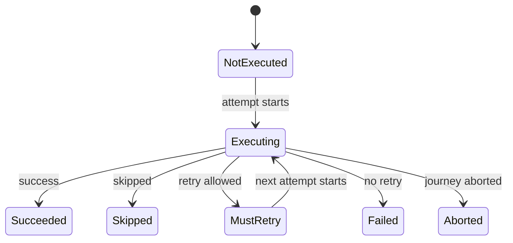

# 5. Running a journey

Specification 0.1. Written from proposals [0009](../proposals/0009-running-a-workflow.md) as amended by [0032](../proposals/0032-configuration-errors.md), [0012](../proposals/0012-local-executor.md), [0040](../proposals/0040-events-facts-and-decisions.md), [0042](../proposals/0042-configuration-errors-before-the-journey.md), [0049](../proposals/0049-custom-code-that-throws.md), [0054](../proposals/0054-how-custom-code-fails.md), [0056](../proposals/0056-data-bag-values.md), [0058](../proposals/0058-building-policies.md), [0061](../proposals/0061-instance-carries-journey-id-and-reporters.md), [0062](../proposals/0062-workflow-descriptors.md), [0063](../proposals/0063-dispatcher-factory.md), [0065](../proposals/0065-business-result.md), [0083](../proposals/0083-what-failures-carry.md) and [0024](../proposals/0024-abnormal-termination-retriable.md).

How an executor runs a workflow instance: the instance and its data, journey IDs, the scan, step statuses, retries, the result, and the executor itself. What the hooks called along the way may decide is defined in chapter 6; where this chapter says "by default", a hook may change it there.

## 5.1 The workflow instance

1. **One workflow instance per journey.** The developer's own code creates a workflow instance from a workflow for each journey and hands it to an executor. Creating it produces, in this order, its initial data, its journey ID (5.2) and its reporters, which MAY receive the journey ID. A failure while creating the instance, including in producing the ID or making a reporter, happens before the executor is involved, and the specification defines nothing more about it.
2. **Initial data.** The instance MAY be created with initial data, and MAY obtain more while it is created. Whatever it holds when handed to the executor MUST be the initial content of the data bag. Keys are strings, and every value MUST be a value (chapter 4, 4.6); initial data that is not a value is refused by `run`, listing each key concerned (chapter 3, 3.7).
3. **The instance holds the journey's state.** The data bag and all other journey state belong to the instance. The instance provides its workflow descriptor (chapter 3, 3.1), the roles, its journey ID, its reporters and its data; the executor builds every step and policy from the descriptors, and an instance never builds, holds or orders them.
4. **An instance runs at most one journey.** Handing an executor an instance that has already run, or is running, MUST be refused as a configuration error.

## 5.2 Journey IDs

1. In tier 1 a journey has exactly one run, so it has one ID, the **journey ID**.
2. **The instance provides its journey ID.** It is produced while the instance is created, and the executor MUST use it; the executor never produces an ID. How it is produced is the workflow's choice: implementations MUST offer a default that produces a UUID v4, used unless the workflow provides its own way, which MAY derive the ID from the instance's data.
3. The caller does not pass an ID to `run`.

## 5.3 The data bag

1. Each journey has one data bag, held by the workflow instance.
2. It starts with the initial data. `journey_started` MUST list the initial keys and MUST NOT carry their values.
3. It receives committed contributions, from steps (chapter 4) and hooks (chapter 6), and is read by input resolution (chapter 4) and by hooks' requests (chapter 6). Nothing else changes it.

## 5.4 Step statuses

1. Every step has a status in the journey:

   | Status | Meaning |
   |---|---|
   | `NotExecuted` | the step has not run yet, or never ran |
   | `Executing` | an attempt of the step is running |
   | `MustRetry` | the last attempt failed and another will be made |
   | `Succeeded` | the step succeeded |
   | `Failed` | the step failed and will not be tried again |
   | `Skipped` | the step skipped itself |
   | `Aborted` | the journey was aborted during this step |

2. Every step starts as `NotExecuted`. After an abort, the steps after the aborted one remain `NotExecuted`.
3. **Run-once.** A step that ended as `Succeeded`, `Failed` or `Skipped` MUST NOT run again in the journey.

## 5.5 Order and the scan

1. **Strict order.** Steps MUST run in the order of their step descriptors. Nothing can reorder steps, skip a step other than the step itself, or jump between steps.
2. **The scan.** The executor repeatedly considers the first step that is not finished:
   - a `Succeeded` or `Skipped` step is passed over;
   - a `NotExecuted` or `MustRetry` step is built and run (chapter 4), as its next attempt;
   - a `Failed` step ends the journey as failed;
   - when no step is left, the journey succeeds.

The diagram shows these transitions:

1. A step starts as `NotExecuted`, and becomes `Executing` when its first attempt starts.
2. From `Executing`, it becomes `Succeeded` on success, `Skipped` on a skip, `MustRetry` when a retry is allowed (5.6), `Failed` when no retry is allowed, and `Aborted` when the journey is aborted during it.
3. From `MustRetry`, it becomes `Executing` again when the next attempt starts.
4. `Succeeded`, `Skipped`, `Failed` and `Aborted` are final.

## 5.6 Attempts and retries

1. **Attempts are counted from 1.** The first execution of a step is attempt 1. A step with a retry budget of N MUST be attempted at most N + 1 times.
2. **What is retried.** A retriable failure, or an abnormal termination when the step descriptor sets `abnormal termination retriable`, MUST put the step in `MustRetry` while its retry budget allows another attempt. Both use the same budget. The decision is recorded by `step_retrying` (chapter 2).
3. **When the budget is exhausted**, the step becomes `Failed`, and its failure hook is called with the cause `retries exhausted`. Whenever a step becomes `Failed`, the decision is recorded by `step_given_up`, with its cause (chapter 2).
4. **What is not retried.** A failure that is not retriable makes the step `Failed` at once, with the cause `failure`. An abnormal termination that is not retriable makes the step `Failed` at once, with the cause `abnormal termination`.
5. **A retry happens immediately.** The executor MUST NOT wait between attempts. A step that needs to wait before reporting a failure does so itself.

## 5.7 How a journey ends

1. **Succeeded:** every step ended as `Succeeded` or `Skipped`, or a hook returned `FinishWorkflow` (chapter 6). Steps that did not run remain `NotExecuted`.
2. **Failed:** a step ended as `Failed`, or a hook returned `FailWorkflow` (chapter 6). Later steps do not run, and remain `NotExecuted`.
3. **Aborted:** something illegal happened. The step during which it happened, if any, becomes `Aborted`; later steps remain `NotExecuted`, and no hook runs afterwards. The abort reasons are:

   | Abort reason | When | Defined in |
   |---|---|---|
   | `step could not be built` | a step's constructor, or the input adapter resolving one of its inputs, failed or supplied something that is not a value | chapter 4 |
   | `policy could not be built` | a step policy failed while being built for an attempt | chapter 6 |
   | `required data missing` | a required request has no value | chapters 4 and 6 |
   | `wrong type` | a requested value has the wrong type | chapters 4 and 6 |
   | `invalid lifecycle` | a hook returned a lifecycle it may not return | chapter 6 |
   | `not a value` | a step or hook contributed, emitted or gave in a reason's details something that is not a value | chapters 2 and 4 |
   | `hook failed` | a hook, or a role operation it called, failed | chapter 6 |
   | `reporter failed` | a reporter, or a dispatcher while dispatching, failed | chapter 2 |

   All but the last two are configuration errors that can only show up during a journey. `hook failed` and `reporter failed` are faults while running, with the same rules for the event stream.

## 5.8 The result

1. **The result is a business outcome.** It MUST carry:
   1. the **journey ID**;
   2. the **final status**, with what explains it:
      - **succeeded**;
      - **failed**, with its **cause**, the **reason** when a step or hook gave one, and the **error** when an error ended the last attempt:

        | Cause | Reason | Error |
        |---|---|---|
        | `failure` | the step's reason | none |
        | `retries exhausted` | the reason of the last attempt, if it reported a retriable failure | the error of the last attempt, if it ended in an abnormal termination |
        | `abnormal termination` | none | the error |
        | `FailWorkflow` | the reason the hook gave | none |

      - **aborted**, with the abort reason and its details, and the **error** when custom code caused the abort by failing (5.10);
   3. the **data bag** as it stood at the end: the initial data plus every committed contribution. The data bag is the journey's output.
2. **How an error is carried.** Wherever the result carries an error, it MUST carry its message, and SHOULD carry the error itself, so that the caller can inspect it, in every language that can hold any error in one value. An error's message is the language's own text for it; when the error comes from a failure scripted with a message, as conformance does, it is exactly that text.
3. **Content, not shape.** This section lists what a result carries. Whether a language represents it with a tagged union, optional fields or anything else is its own choice.
4. **Not in the result:** each step's status and attempt count, and the name of the step that failed or during which the journey was aborted. They are in the event stream: `attempt_started`, the outcome facts and the decisions give every step's status and attempt count, an attempt counting from its `attempt_started`, and `journey_failed` and `journey_aborted` name the step. Implementations MAY offer a way to derive step statuses from a journey's event stream, but it is not part of the result.

## 5.9 The executor

1. **Executors differ in capability, never in meaning.** A lifecycle, an outcome, a status or an event MUST mean the same under every executor.
2. **Executors are not coupled to workflows.** An executor MUST NOT depend on how a workflow, its descriptor or its instance was produced: by a builder, by macros or annotations, or by hand. Any executor of a language MUST be able to run any instance of that language. How this abstraction is expressed is each language's choice, recorded in its tech spec; 5.13 suggests what an instance usually provides.
3. **The local executor** runs a journey in process, with no persistence: a journey lives only as long as the call that runs it.
4. **`run(workflow instance)`** MUST run exactly one journey and return its result. It MUST NOT throw for anything that happens inside the journey: failures and aborts are in the result. An asynchronous executor returns the same result asynchronously. A workflow refused at admission (chapter 3), when it is built or because the executor does not accept a mode, and a failure before the journey starts (5.10), are reported to the developer as a refusal instead: no journey and no event. An unrecoverable failure is not a result either (5.10).
5. **Stateless between journeys.** When `run` returns, nothing of that journey MUST remain in the executor: no data, no statuses, no reporters. An executor MAY run many journeys, one after another.
6. **One journey at a time.** An executor MUST NOT run two journeys concurrently. A call to `run` while another journey is running on the same executor MUST be refused before anything starts, with no journey and no events. Implementations SHOULD make this impossible to write where their language allows it. Parallelism comes from creating several executors.
7. **One dispatcher per journey**, created by the executor's dispatcher factory, as chapter 2 defines.

## 5.10 How custom code fails

1. **All custom code fails the same way:** by throwing, or by returning an error through its signature, wherever this specification does not give that error another meaning. Both are **recoverable failures**, and implementations MUST catch every one of them. What differs is the consequence: a step can recover, so its failure is an abnormal termination, which its descriptor may retry; hooks, role operations, reporters and dispatchers cannot report an error and carry on, so their failure aborts the journey.
2. **Nothing custom code throws or returns as an error MAY escape `run`.** In tier 1, the executor calls custom code at exactly these points, with these outcomes:

   | Custom code | When it fails |
   |---|---|
   | the dispatcher factory, or the dispatcher while the journey's reporters are added | a refusal: no journey and no event |
   | a workflow policy, while it is built | a refusal: no journey and no event |
   | a step policy, while it is built for an attempt | the journey is aborted with `policy could not be built` (chapter 6) |
   | a step's constructor, or the input adapter for one of its inputs | the journey is aborted with `step could not be built` (chapter 4) |
   | a running step | an abnormal termination of the attempt; the journey is not aborted (chapter 4) |
   | a hook, including a role operation the hook calls | the journey is aborted with `hook failed` (chapter 6) |
   | a reporter, or a dispatcher while dispatching, on any event except `journey_aborted` | the journey is aborted with `reporter failed` (chapter 2) |
   | a reporter, or a dispatcher, while `journey_aborted` is being delivered | ignored: the first abort reason stands and no further event is emitted (chapter 2) |

3. **The list is exhaustive for tier 1.** A later proposal that adds a call into custom code adds it here, with its outcome. Producing the journey ID and making the reporters happen while the instance is created, before the executor is involved (5.1).
4. **The error travels with its consequence.** When custom code fails and the journey is aborted, the abort carries that error: in `journey_aborted`, as its message, and in the result, as 5.8 point 2 says. This covers `hook failed`, `reporter failed` (for a reporter, or a dispatcher while dispatching), and `step could not be built` and `policy could not be built` when a constructor, an input adapter or a policy failed. An abort that no error caused, such as `required data missing`, `wrong type`, `not a value`, or `step could not be built` because something supplied is not a value, carries no error. A refusal caused by failing custom code carries that error, with its message, as the result does.
4. **Unrecoverable failures are outside the model.** In a language that separates unrecoverable failures from recoverable ones, as the language defines them (for example a panic in Rust, or an `Error` such as `OutOfMemoryError` on the JVM), an unrecoverable failure is not a recoverable failure. The journey stops as if the process had crashed: no further event is emitted, so the stream may end without `journey_succeeded`, `journey_failed` or `journey_aborted`, and `run` produces no result. Implementations MUST NOT catch it in order to continue the journey or turn it into an outcome; it propagates to whoever called `run`, as the language defines.

## 5.11 Execution modes

1. The tier 1 execution modes are `sync` and `async`. An executor declares which modes it accepts, for steps, hooks and reporters alike.
2. Anything in a mode the executor does not accept is the violation `mode not accepted`, refused at admission when the instance is handed to `run`, before the journey starts (chapter 3).
3. Whether an asynchronous executor also accepts synchronous steps, hooks and reporters is each language's choice, stated as a capability.
4. A language claims its capabilities, the modes its executors accept, alongside its tier, and its conformance runner runs the cases tagged with them.

## 5.12 Checked by

In the conformance repository: [`0009-running-a-workflow/`](https://github.com/itinera-dev/conformance/tree/main/cases/tier-1/0009-running-a-workflow), [`0012-local-executor/`](https://github.com/itinera-dev/conformance/tree/main/cases/tier-1/0012-local-executor), [`0049-custom-code-that-throws/`](https://github.com/itinera-dev/conformance/tree/main/cases/tier-1/0049-custom-code-that-throws), [`0054-how-custom-code-fails/`](https://github.com/itinera-dev/conformance/tree/main/cases/tier-1/0054-how-custom-code-fails), [`0058-building-policies/`](https://github.com/itinera-dev/conformance/tree/main/cases/tier-1/0058-building-policies), [`0061-instance-carries-journey-id-and-reporters/`](https://github.com/itinera-dev/conformance/tree/main/cases/tier-1/0061-instance-carries-journey-id-and-reporters), [`0065-business-result/`](https://github.com/itinera-dev/conformance/tree/main/cases/tier-1/0065-business-result), and the retry cases of [`0008-steps/`](https://github.com/itinera-dev/conformance/tree/main/cases/tier-1/0008-steps) and [`0024-abnormal-termination-retriable/`](https://github.com/itinera-dev/conformance/tree/main/cases/tier-1/0024-abnormal-termination-retriable). Running an instance twice and calling `run` concurrently are checked by each language's own tests, since many languages make both impossible to write.

## 5.13 A suggested instance interface (not normative)

This section is a suggestion, not part of the specification (5.9 point 2). An instance usually provides to an executor:

1. its workflow descriptor (chapter 3, 3.1);
2. the roles the workflow provides (chapter 6, 6.8);
3. its journey ID and its reporters, already made (5.1);
4. its data bag, which it holds and owns for the whole journey;
5. **data for a step**: given a step being built and one of its inputs, the value or its absence, through the step's input adapter, then the data bag (chapter 4, 4.2);
6. **data for the workflow**: given a hook's request, the value or its absence, from the data bag only (chapter 6, 6.6);
7. **committing a contribution**: given a key, a value and its source, commit it, saying whether it replaced an earlier value.

Operations 5 and 6 also report what happened (which adapter supplied or failed, which optional requests were absent, a missing or wrongly typed value), so the executor can emit the events and aborts the specification requires.
